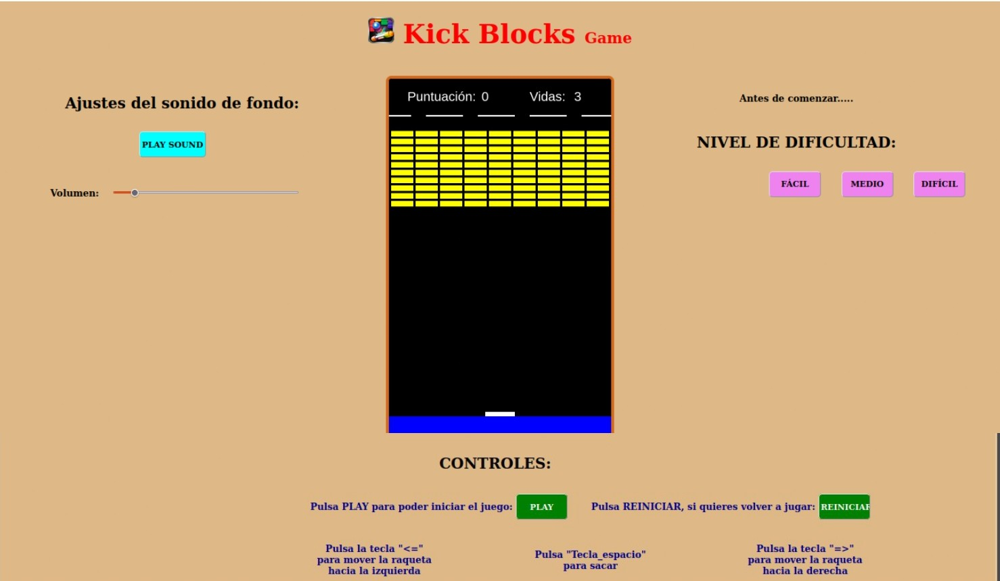
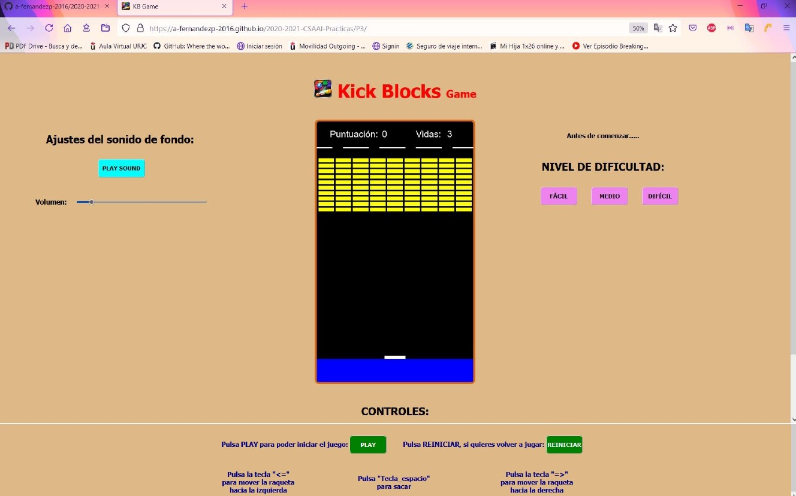
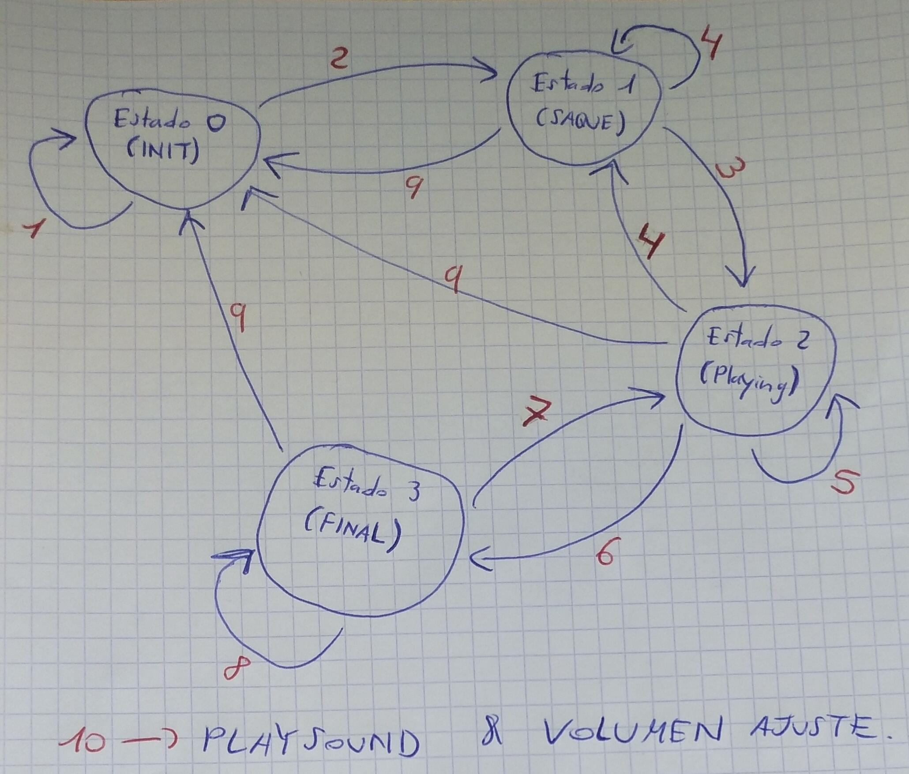
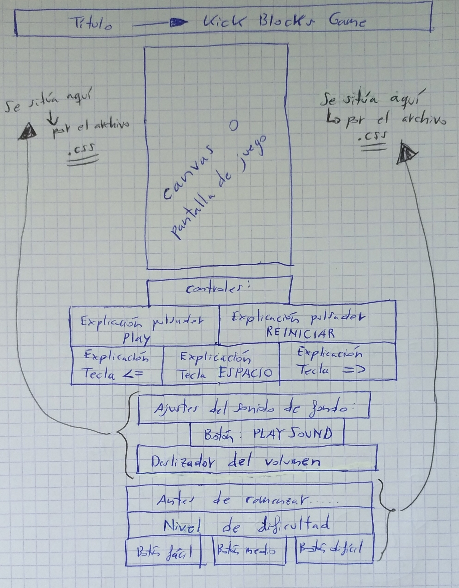

 # Práctica 3: Videojuego retro.

 ### **Especificaciones de la práctica.**
 

Cuando muestres el contenido de mi Práctica 3 en el Navegador, a través de su correspondiente URL, **debes poner la pantalla al 50% de ZOOM, para que se vea la pantalla del juego entera sin utilizar la rueda del ratón y, por tanto, que puedas jugar correctamente**.
  
  

Debes mostrarlo en el Navegador de Mozilla Firefox (qué es el navegador en que el autor de esta práctica ha trabajado) y, en el Sistema Operativo (S.O) de Windows 10. También, lo puedes mostrar en el S.O de Ubuntu-Linux, aunque el texto de la parte de controles y los botones de dificultad se desalinean, por lo que ya comenté en la P1 de los formatos de cada Navegador y de cada S.O que utiliza cada uno. Véase en una imagen:
  
En S.O Ubuntu-Linux y Navegador Mozilla Firefox:

En S.O Windows 10 y Navegador Mozilla Firefox:

No lo visualices en tu móvil o smartphone, ya que al ser la resolución de pantalla mucho menor, todos los textos se unirán y se verá mal y, aparte, no podrás jugar porque **es necesario un teclado de PC para jugar**.

### **Ahora pasamos a la explicación del videojuego retro:**

El desarrollo del videojuego se divide en dos partes:

    1. La parte Obligatoria.
    2. La parte de Mejoras.

 

#### 1. LA PARTE OBLIGATORIA:

El juego consta de cuatro Etapas o Estados, que están explicadas gráficamente en la siguiente imagen:

Etapas o Estados:

    1) ESTADO 0 => INIT.
    2) ESTADO 1 => SAQUE.
    3) ESTADO 2 => PLAYING.
    4) ESTADO 3 => FINAL.

Explicación de los nº en rojo:

1. Para volver al Estado Inicial o permanecer en dicho estado, hay que darle a Reiniciar (volver a jugar desde el principio), o eligiendo un nivel de dificultad (esto sólo se puede hacer en el Estado Inicial y sólo se puede elegir 1. Una vez das a PLAY, ya no sirve pulsar un nivel de dificultad, a no ser que reinicies y vuelvas de nuevo al Estado Inicial).
2. Para pasar del Estado Init al de Saque, hay que pulsar el PLAY y, así, iniciar el juego/videojuego. Si no pulsas el PLAY, no podrás empezar a jugar.
3. Para pasar del Estado de Saque al de Playing, hay que pulsar la **tecla de saque**, que es el ESPACIO del teclado QWERTY de tu PC. Si no pulsas dicha tecla, la bola no sacará y no comenzará a moverse.
4. El juego vuelve de nuevo al Estado de Saque, cada vez que pierdas una vida, hasta que te queden 0 vidas.
5. El juego se mantendrá en el Estado Playing, mientras tengas vidas y al tener 0 vidas no te caigas al agua, o hasta que rompas todos los ladrillos amarillos. El Estado Playing es el Estado interactivo, donde el usuario podrá usar los controles que se explican debajo del Canvas o Pantalla de juego. Los controles del Estado Playing son: 
    1) Tecla <=.
    2) Tecla =>.

6. El juego pasará al Estado Final, cuando se llegue a la puntuación máxima (que es igual al nº de filas por el nº de columnas de ladrillos, ya que cada uno de ellos vale 1), o que la bola se caíga al agua, quedando 0 vidas. En el primer caso, sonará un sonido de victoria y, saldrá un mensaje de victoria. En el segundo caso, sonará un sonido de derrota y, saldrá un mensaje de derrota.
7. PROCESO NO VÁLIDO. El juego no puede volver del Estado Final al Estado Playing.
8. El juego se mantendrá en el Estado Final, es decir, con el mensaje de victoria o de derrota, hasta que se pulse la tecla REINICIAR para volver a optar a jugar de nuevo.
9. Siempre, independientemente del Estado en que estés, podrás pulsar a REINICIAR, para volver al Estado Inicial.
10. Independientemente del Estado en que estés, puedes pulsar PLAY SOUND, para volver a iniciar la canción/sonido de fondo y, ajustar el volumen al nivel sonoro que desees (ten en cuenta que si lo subes a un nivel alto-medio, puede que los sonidos del golpeo de la bola con las paredes y la raqueta, el sonido de los ladrillos rompiéndose, el sonido de saque inicial, el de victoria o el de derrota, no se escuchen porque solapen los sonidos). Darle a PLAY SOUND o ajustar el nivel sonoro con el deslizador del volumen, NO implica cambiar de Estado.

La estructura del código HTML (código y archivo principal) es la siguiente:

El código y archivo .CSS, es para dar estilo, colores, formato y formas a nuestro videojuego retro y página HTML.

El código y archivo .JS, es para llevar a cabo todas las acciones y movimientos del videojuego retro y, mostrarlos en la página HTML.

La cabecera o pestaña del Navegador Mozilla Firefox es la siguiente:

    1. Logo o icono del videojuego retro.
    2. Siglas del Título del videojuego retro: KB Game = Kick Blocks Game.

