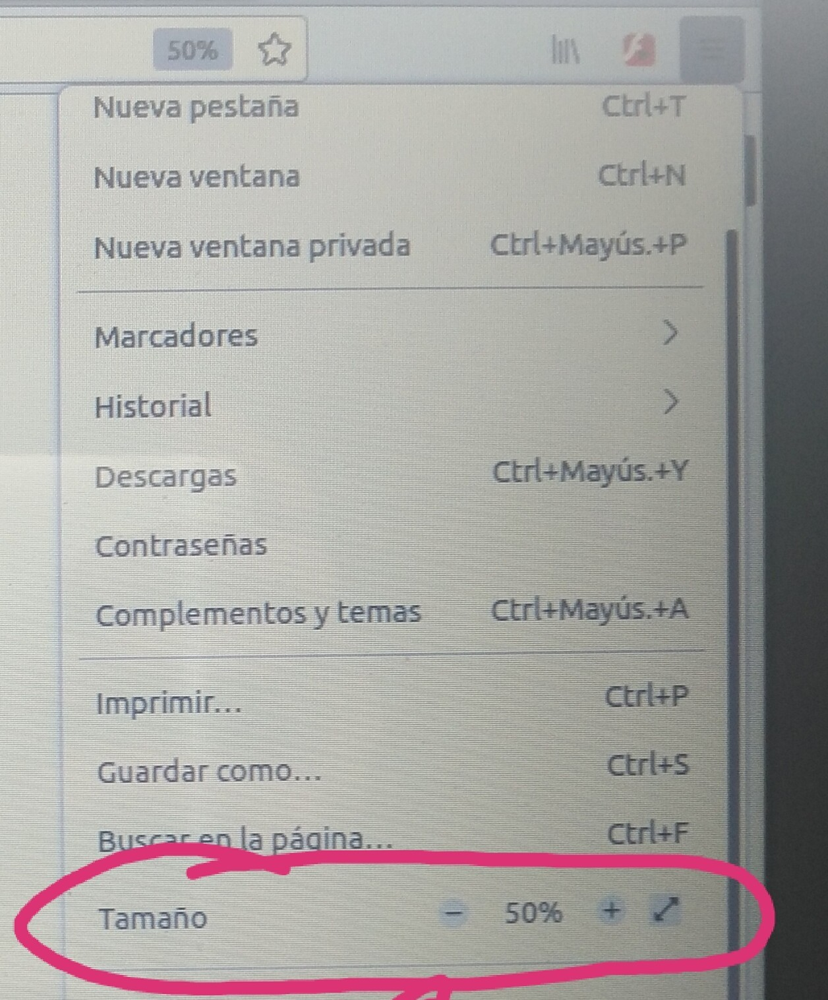

 # Práctica 3: Videojuego retro.

 ### **Especificaciones de la práctica.**
 

Cuando muestres el contenido de mi Práctica 3 en el Navegador, a través de su correspondiente URL, **debes poner la pantalla al 50% de ZOOM (si en tu Pantalla ves que es muy pequeño, si quieres, sube un poco el ZOOM), para que se vea la pantalla del juego entera**.  
  
  

Debes mostrarlo en el Navegador de Firefox, con S.0 (Sistema Operativo) Ubuntu-Linux.

