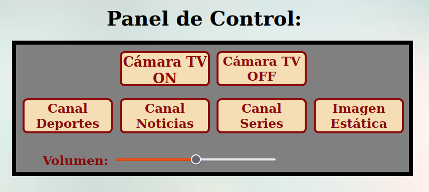
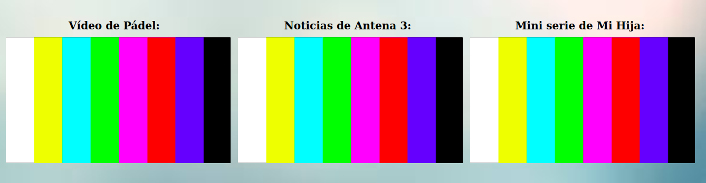

 # Práctica 5: Realizador de TV.

### **Especificaciones de la práctica.**
 

Para mostrar la P5 en el Navegador, lo tenemos que llevar a cabo en el Sistema Operativo - S.O de **Ubuntu-Linux** y, en el Navegador de **Mozilla Firefox**. El zoom del Navegador para mostrar el tamaño de pantalla, se deja al 100%, que es el estándar, el que viene por defecto. Para acceder, se hace a través del siguiente link: **https://a-fernandezp-2016.github.io/2020-2021-CSAAI-Practicas/P5/**.

 

El diseño del icono del título del cuerpo y de la pestaña de la Pág HTML, se ha diseñado y realizado a través del programa **Adobe Photoshop 2018** de **My APPs URJC**. Bastante trabajado, la verdad. 

A continuación, veréis las imágenes de ambos iconos:

Cabecera/Pestaña pág HTML:

Icono del título en el body:

El estilo de la P5 se lleva a cabo con CSS. El programa principal es HTML. Y las acciones de programación del programa de la P5 es con JavaScript.

A continuación, verás el vídeo en emisión (en apagado). Si quieres que cambie, debes pulsar a Cámara TV ON. Si pulsas otro botón será inválido por la regla de **Diagrama de Estados**.

Diagrama de Estados:

Cada nº en rojo significa lo siguiente:

1. El usuario se mantiene en el Estado Inicial, 1) porque todavía no le ha dado al botón de Cámara TV ON. O, 2) porque el usuario le ha dado a Cámara TV OFF, es decir, ha vuelto al Estado Inicial y no ha apretado el botón de Cámara TV ON, por eso se mantiene.
2. Vamos al Estado de Emisión (1), al apretar el botón de: Cámara TV ON.
3. El usuario se mantiene en el Estado de Emisión (1), al apretar el botón de: Select Camera 1, Select Camera 2, Select Camera 3 e Imagen estática.
4. Finalmente, vamos al Estado Inicial de nuevo, porque el usuario le ha dado a Cámara TV OFF.

Vídeo en emisión en directo apagado:

El panel de control, desde donde el realizador (o usuario) controla los vídeos, se ha realizado en forma de tabla con 2 filas y 4 columnas, la 1º fila para los botones de: Cámara TV ON y Cámara TV OFF y, la 2º fila para los botones de: Select Camera 1, Select Camera 2, Select Camera 3 e Imagen estática.

Imagen del Panel de Control del Realizador:

Imagen de los tres vídeos en segundo plano sin sonido:

 

Y, esto es todo el programa del Realizador de TV: Férez World TV, en HTML, CSS y JS. Espero que la valoración que se haga sea buena, o incluso, muy buena. Es un trabajo con bastante esfuerzo, sacrificio y horas.
 
 
Muchas gracias por su tiempo y atención.

Atentamente.

El autor del programa: **Férez World TV** =es> **Alejandro Fernández Pérez**, alumno de GISAM (URJC).